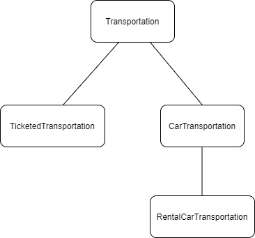

# Week 6 Review - Inheritance and Polymorphism

**Note:** There is no lecture code for this week, because all the examples are in the Vacation Expense Estimator project. If you need more straightforward examples to address student questions, you can use this week's tutorials.

## Primary objectives

- Describe the purpose and use of inheritance in an Object Oriented Programming language
- Define and use superclasses and subclasses in an inheritance hierarchy
- **Identify superclasses and subclasses from viewing source code**
- Define an IS-A relationship in reference to inheritance
- **Define what overriding means in the context of inheritance**
- Describe what's being inherited
- Utilize superclass constructors in a subclass
- Define and use abstract classes and methods
- Explain the concept of polymorphism and how it's useful
- Demonstrate an understanding of where inheritance can assist in writing polymorphic code
- State the purpose of interfaces and how they're used
- Use polymorphism through inheritance using IS-A relationships
- **Use polymorphism through interfaces using IS-A relationships**
- Give examples of interfaces from the Java standard library (for example, Collections)
- Describe the difference between an Interface and an Abstract Class


## Objective 1: Identify superclasses and subclasses from viewing source code

### Opening

One of the primary benefits of inheritance is that related classes don't need to duplicate code to have the same capabilities. They can instead share a common method located in a superclass. Ask the students to list some reasons why having duplicate code in a program makes it hard to maintain. For example:
* making a change requires extra work to update all the copies
* you might forget to update one copy, introducing (or failing to fix) a bug
* when someone else works on the code, they won't know where all the copies are
* it clutters the source code, making it harder to find other code you're looking for

Some common difficulties with superclasses and subclasses are:
* using inheritance when composition would be more appropriate
* realizing that a subclass inherits from **all** of its ancestors, not just the immediate superclass
* remembering that all classes implicitly inherit from `Object`

### Example

In the Vacation Expense Estimator project, point out the Transportation class hierarchy:



Discuss the implementation of these classes and make sure students understand the difference between:
    - `RentalCarTransportation` being a subclass of `CarTransportation` (inheritance)
    - `RentalCarTranportation` being the type of a member variable in `TicketedTransportation` (composition)

You can also note that `CarTransportation`, `RentalCarTransportation`, and `TicketedTransportation` all have a `description` property (and the associated getters and setters), inherited from `Transportation`.

### Next steps

There aren't many other examples of inheritance in the VEE, but there are several other examples of composition. Discuss one of those (like the `Vacation` class) and why inheritance **wasn't** the right design choice for that situation.

You can also remind students that every class has `Object` as a superclass. That means you can call the methods listed here on any object: https://docs.oracle.com/en/java/javase/11/docs/api/java.base/java/lang/Object.html


## Objective 2: Define what overriding means in the context of inheritance

### Opening

Show students this code, run it, and note the difference in output. Ask students to think about where this difference in formatting is coming from. Discuss why it wouldn't be a good idea to have the `System.out.println()` method include rules for how to print out every Java class, and is a better approach to have each class override the `toString()` method it inherits from the `Object` class. (You'll probably need to remind students that `System.out.println()` calls `toString()` on the objects passed to it.)

```java
import java.time.LocalDate;
import java.util.ArrayList;
import java.util.Collections;
import java.util.List;

public class Demo {

    public static void main(String[] args) {
        List<Integer> numbers = new ArrayList<>();
        Collections.addAll(numbers, 2022, 12, 31);
        LocalDate date = LocalDate.of(2022, 12, 31);

        System.out.println(numbers);
        System.out.println(date);
    }
}
```

Some common difficulties with overriding in the context of inheritance are:
* not understanding the value of the `@Override` annotation
* confusing overriding and overloading
* using `super` to call the method you're overriding

### Example

In the Vacation Expense Estimator project, you can point out that almost every class in the `model` package overrides the `toString()` method. To demonstrate the value of the `@Override` annotation, remove it from one of the `toString()` methods. The code still compiles and runs just fine. However if you then change the spelling or capitalization in the method name (to `tostring()` or `toStrings()` for example), the code still runs but doesn't produce the desired output, because the `toString()` method is no longer overridden. Adding back the `@Override` annotation causes a compiler error to appear, which helps you find the misspelled method name--the annotation helps you confirm you're actually doing what you intended. 

Search for `//Example: overloading a constructor` and `//Example: overloading a method` to find examples of overloading methods, and discuss how this differs from overriding methods.

Search for `//Example: calling a method being overridden` to find an example of using the output of a method in another method that overrides it. This approach avoids duplicating code while allowing the subclass to enhance the capability of the superclass.

### Next steps

Students may ask about the `@Override` annotation on methods that aren't overriding a method from a superclass, but are implementing a method from an interface. Let them know this is another use of that annotation (that serves the same purpose--making sure you're doing what you intended).

For a more complex example of overriding methods, you can use the methods in `RentalCarTransportation` that implement the `BasicXml` interface. Those methods call the methods they override in `CarTransportation` which call the methods they override in `Transportation`. You could set a breakpoint and walk through that process with students in the debugger.


## Objective 3: Use polymorphism through interfaces using IS-A relationships

### Opening

An HDMI connector is a good example of a hardware interface. A television with an HDMI input can display video from any device with an HDMI output, whether it's a DVR, a game console, or a laptop computer. Imagine how awkward it would be if you needed a different kind of connector (or a different television) for each kind of device. Briefly brainstorm a few other examples of everyday interfaces that enable various things to work together like power outlets, USB connectors, garden hoses with nozzles and sprinklers, etc.

It's a similar situation when writing code to perform the same operations with a variety of different classes. It would be undesirable to duplicate that code over and over for each class that it needs to work with. Instead, your code can use an interface that all those classes implement. When your code calls one of the methods specified by the interface, the call goes to the implementation in the appropriate class. This is an example of polymorphism.

Some common difficulties with polymorphism and interfaces are:
* confusion about when to use an interface vs. inheritance
* mistakenly putting code in interfaces
* branching based on `instanceof` rather than calling a polymorphic method

### Example

In the Vacation Expense Estimator project, search for `//Example: using polymorphism through an interface`. Point out that in this method, there's no mention of any of the actual classes involved. The variable that has the interface as its type refers to instances of different classes at different points during the execution of the program. Use the debugger to demonstrate how the same line of code calls different methods depending on the class of the object that variable refers to.

You can find other good examples that use the `Expense`, `ChildAndSeniorPriceable`, and `BasicXml` interfaces. The application contains several other interfaces besides those, but since the others exist to facilitate unit testing, discussion of them is probably best deferred until a future session.

### Next steps

Polymorphism is also possible by using a superclass to represent any of its subclasses. You can find an example of this by searching for `//Example: using polymorphism through inheritance`. Discuss the pros and cons of using inheritance vs. using an interface.

You can remind students that they've already been using interfaces from the Java standard library. This includes common ones like `List` and `Map`, as well as more obscure ones like `Iterable` (the interface that allows an object to be the target of a foreach loop).

Students may notice that the compiler allows method implementations in an interface. If it comes up, make sure they understand that this is best avoided. Java added that capability for the sake of compatibility (when developers add a new method to a legacy interface, they can include a default implementation so that all the existing classes that implement that interface aren't broken by the change).
